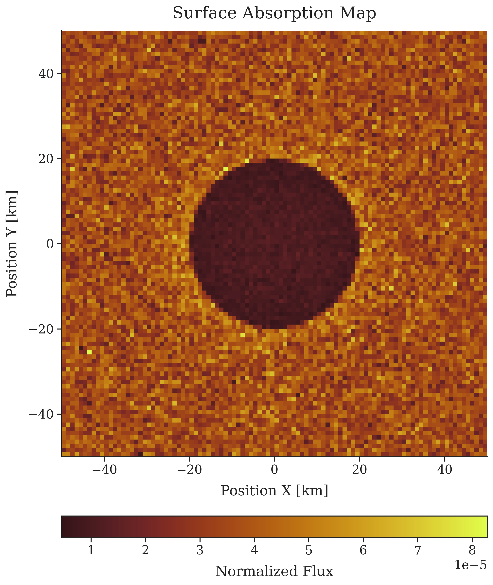
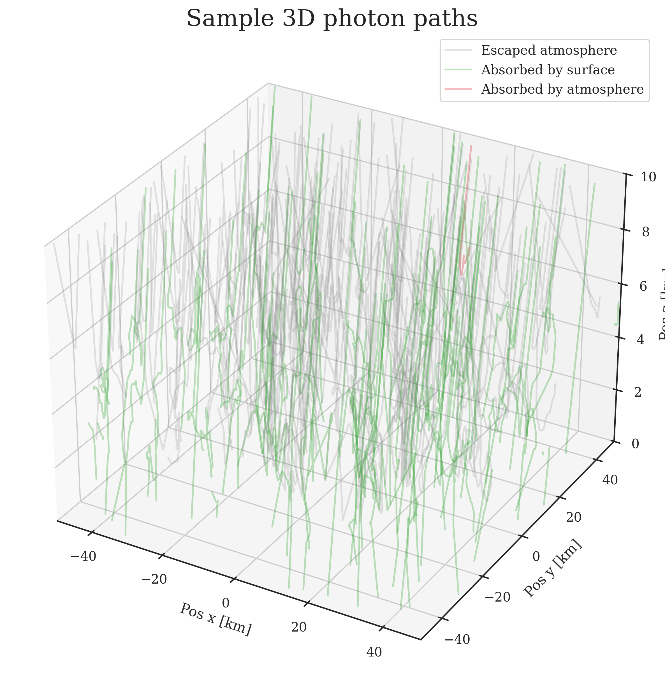
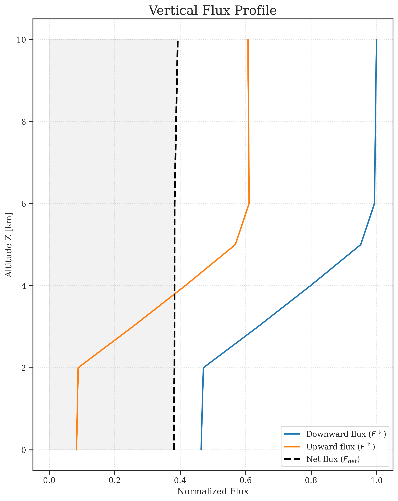
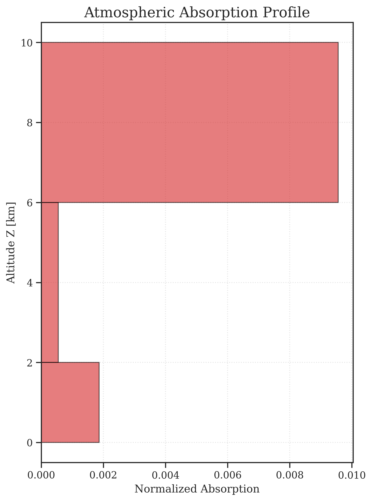

# AtmoRad
## A vectorized Monte Carlo simulation of atmospheric radiative transfer.

[](https://www.python.org/downloads/)
[](https://opensource.org/licenses/MIT)

| **2D Surface absorption map** | **Sample photon paths** |
| :--- | :--- |
|  |  |
| **Vertical flux profile** | **Vertical absorption profile** |
| |  |

## Overview:

This project simulates the propagation of light through a heterogenous, plane-parallel atmosphere and their interactions with mixed surface boundaries. It is my student project that I created to learn computational physics and software development.

### Physical model
- **Discrete photons**: Photons are treated as discrete particles, not as variable packets of energy. Energy is counted as a fraction of total photons. 
- **Plane-parallel approximation**: Atmosphere consists of horizontally uniform layers.
- **Multi-material atmospheric layers**: layers can consist of a few atmospheric materials simultaneously. A photon is assigned a material randomly when it is initialized and again when it crosses into a new layer. Each material has its own optical density, single-scattering albedo and phase function.
- **Custom Phase-Functions**: Henyey-Greenstein and Rayleigh phase function are already implemented in the simulation, but any custom user-defined function can be constructed using the `Scattering` class.
- **Surface Reflections**: Surface consists of materials, each of which having its albedo, a predefined reflection (`Lambertian`, `Mirror`) and a `ProceduralMap` that outputs material ID based on coordinates.
- **Photon Properties**: Light is treated as monochromatic, non-polarized particles. During the simulation they can get scattered, reflected or absorbed. 
- **Incident Flux & Adjacency Effect**: Custom detectors allow measuring downward/upward flux at any arbitrary altitude - helpful for visualizing adjacency effect.


## Technical implementation:
- Simulation uses `numpy` to simulate photons simultaneously in large batches.
- Results are plotted using `matplotlib` and `seaborn` (eg. photon paths, flux profile, 2d ground flux map)
- Code uses multiprocessing to run batches in parallel.
  
## Installation:
- Using `uv` ([install uv](https://docs.astral.sh/uv/getting-started/installation/)):
```
uv tool install atmorad-py
```
- Using `pip`:
```
pip install atmorad-py
```
- Run the simulation:
```
atmorad demo-config.toml
```
- Check `results/` directory for simulation artifacts.

## Project Structure
- `engine/`: divides photons into batches and runs the simulation.
- `Scene`: keeps track of the environment.
- `Atmosphere` and `Surface`: keep track of optical properties, phase functions, reflection functions and layer structures.
- `ResultAnalyzer`: Generates plots based on simulation results.

## Customization
You can define your own surface reflection algorithms and scattering phase functions using decorators as shown below:

```python
import numpy as np
from atmorad import build_context, MCRadiationRunner, DataIO, ResultAnalyzer
from atmorad import SurfaceReflection, register_reflection, orientation
from atmorad import Scattering, register_scattering

# 1. Register a custom surface reflection
@register_reflection("custom-reflection")
class CustomReflection(SurfaceReflection):
    # Specify arbitrary custom parameters
    def __init__(self, param_1, param_2):
        self.param_1 = param_1
        self.param_2 = param_2
    def reflect(self, direction, rand_1, rand_2):
        # Your custom reflection physics here
        cos_theta = np.sqrt(rand_1)
        sin_theta = np.sqrt(1.0 - rand_1)

        # you can also use specified parameters
        # self.param_1, self.param_2

        phi = rand_2 * 2 * np.pi
        cos_phi, sin_phi = np.cos(phi), np.sin(phi)
        
        return orientation(cos_theta, sin_theta, cos_phi, sin_phi)
    
# 2. Register a custom scattering phase function
@register_scattering("custom-scattering")
class CustomScattering(Scattering):
    # Specify arbitrary custom parameters
    def __init__(self, g, resolution=1000):
        # Define a pdf array
        self.g = g
        cos_grid = np.linspace(-1, 1, resolution)

        pdf = (1 - g**2) / (2 * (1 + g**2 - 2 * g * cos_grid) ** 1.5)

        super().__init__(pdf_array=pdf, resolution=resolution)

# 3. Run the simulation using custom names in your config
if __name__ == "__main__":
    context = build_context("simulation.toml")
    runner = MCRadiationRunner(context)
    runner.run()

    # 4. Save and analyze results
    results = runner.get_results()
    outputs = DataIO(context.config)
    analyzer = ResultAnalyzer(results, context.config)
    
    outputs.save_all_artifacts(analyzer, results)
    outputs.save_metadata(context.config, results)
    outputs.save_results(results)
```
In `simulation.toml` you can specify your defined scatterings and reflections:
```toml
[atmosphere_materials.custom-atm-material]
ssa = 0.9
scattering = {type = "custom-scattering", g=0.8} 

[surface_materials.custom-surf-material]
albedo = 0.5
reflection = {type = "custom-reflection", param_1=2, param_2=1.3} # match param names defined in python
```
Then you can use your defined materials for atmospheric layers and surface maps:
```toml
[[layer]]
z_range_km = [0, 2]
materials = [{type = "custom-atm-material", weight = 1.0}]
...

[surface]
name = "uniform"
material = "custom-surf-material"
```

## References and Literature
- (in Polish) Script for Lecture about [Radiative Processes in the Atmosphere](https://www.igf.fuw.edu.pl/~kmark/stacja/wyklady/ProcesyRadiacyjne/2013/WykladRadiacjaKlimat.pdf), Prof. K. Markowicz, Faculty of Physics, University of Warsaw, 2013.

## Acknowledgments
- This project was inspired by the lectures on *Radiative Processes in the Atmosphere* by Prof. K. Markowicz, Faculty of Physics, University of Warsaw.
- Large Language Models were used for code-debugging and learning best Python practices (e.g. `dataclasses`, `__init__.py` import interfaces, class responsibilities, config parsing).

## Contributing
Feel free to open an [Issue](https://github.com/dabrokarol/atmorad-py/issues) or submit a Pull Request if you'd like to contribute or report a bug.

