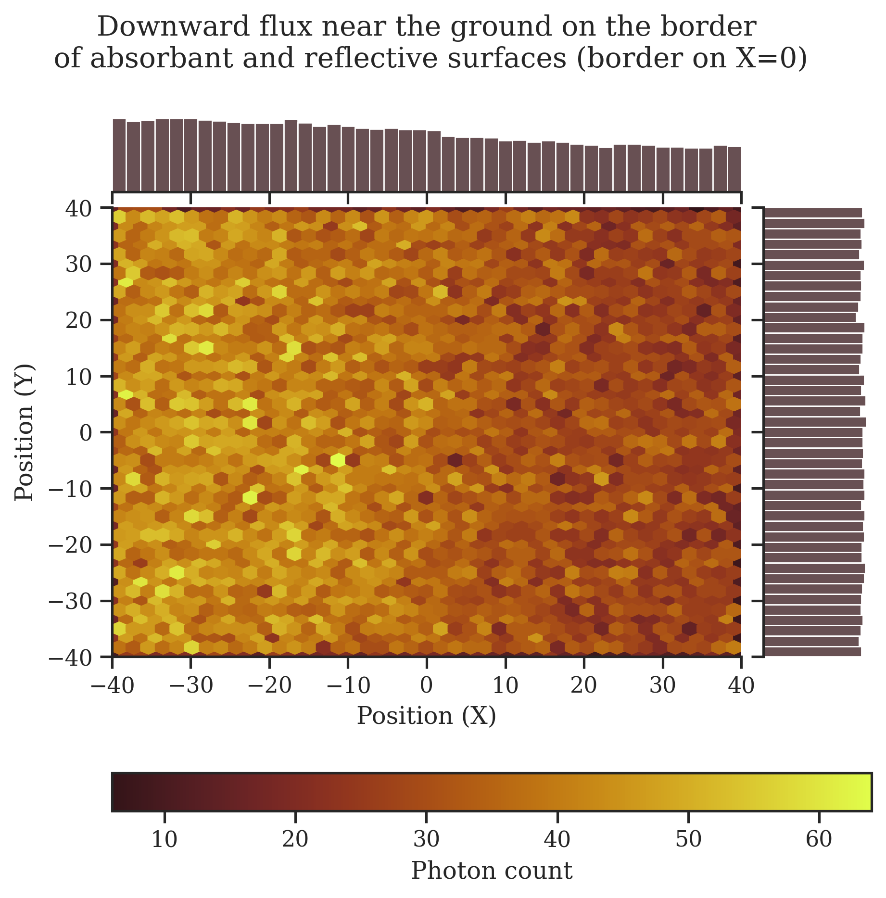
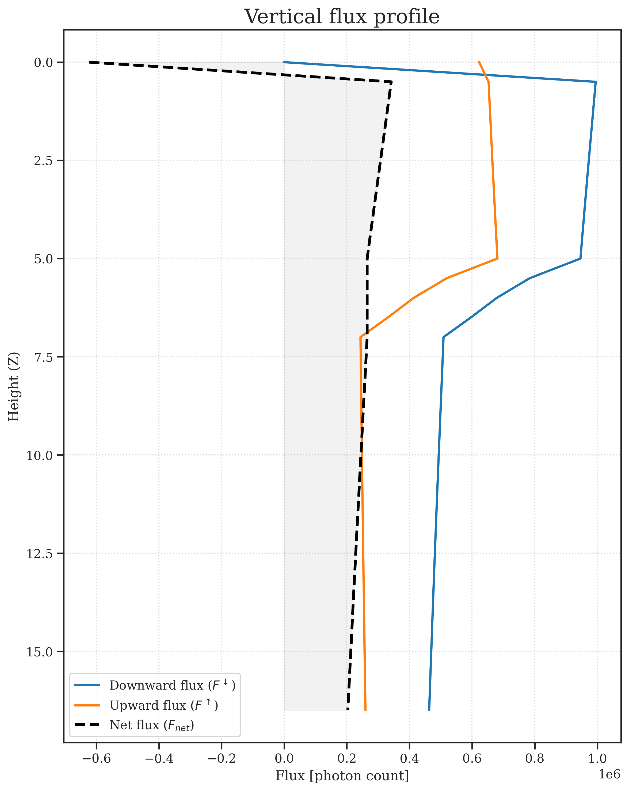
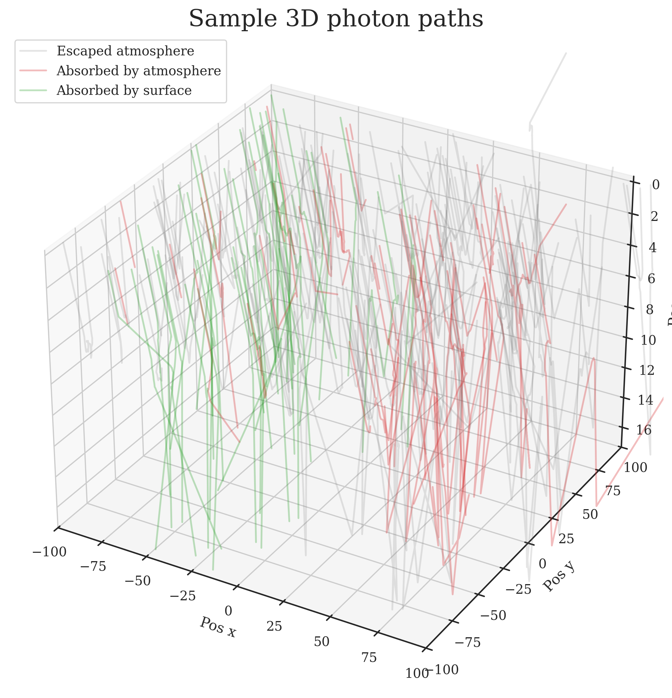
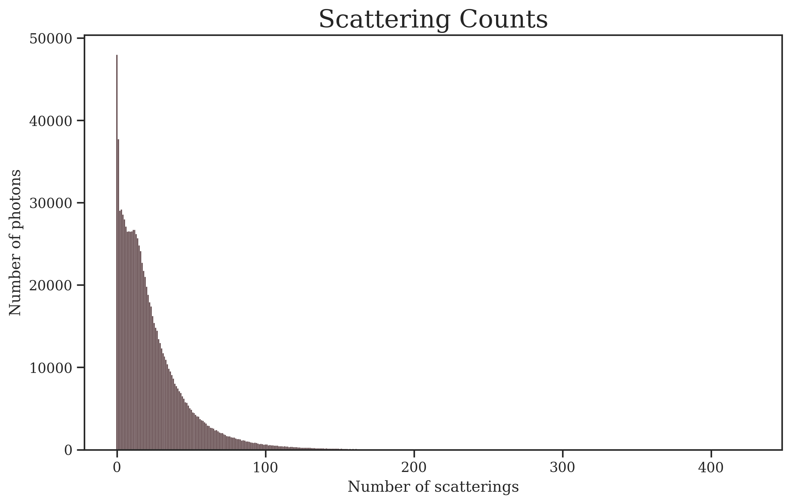

# atmorad.py
## A vectorized Monte Carlo simulation of atmospheric radiative transfer.

[](https://www.python.org/downloads/)
[](https://opensource.org/licenses/MIT)

| 2D Surface flux map | Vertical flux profile |
| :--- | :--- |
|  |  |
| **Sample photon paths** | **Scattering counts** |
| |  |

## Overview:

This project simulates propagation of light through heterogenous, plane-parallel atmosphere and their interactions with mixed surface boundaries. It is my student project exploring computational physics that I took as a chance to learn scientific software development.

### Physical model
- **Plane-parallel approximation**: Atmosphere consists of horizontally uniform layers.
- **Multi-material atmospheric layers**: layers can consist of a few atmospheric materials simultaneously (photon gets assigned material randomly upon entering such layer). Each material has its own optical density, single-scattering albedo and phase function.
- **Custom Phase-Functions**: Henyey-Greenstein phase function is already implemented in the simulation, but any custom user-defined function can be easily constructed using the `Scattering` class.
- **Surface Reflections**: Surface consists of materials, each of which having its albedo, a predefined reflection (`Lambertian`, `Mirror`) and a `ProceduralMap` that outputs material ID based on coordinates.
- **Photon Properties**: Light is treated as monochromatic, non-polarized particles. During the simulation they can get scattered, reflected or absorbed. 


## Technical implementation:
- Simulation uses `numpy` to simulate photons simultaneously in large batches.
- Results are plotted using `matplotlib` and `seaborn` (eg. photon paths, flux profile, 2d ground flux map)
  
## How to run:
### Use UV (Recommended & Fastest)

- If not installed, [install uv](https://docs.astral.sh/uv/getting-started/installation/), a very fast Python package manager.
- Create a virtual environment and install dependencies:
```bash
uv venv
uv pip install -e .
```
- Modify configuration in `main.py` to your liking
- Run the simulation:
```bash
uv run main.py
```
- Check `results/` directory for simulation outputs and plots

### The traditional way (Pip)

- Create a virtual environment:
```bash
python3 -m venv .venv
```
- Activate the environment and install dependencies:
  - Windows
  ```sh
  .venv/Scripts/activate
  pip install -e .
  ```
  - Linux / MacOS
  ```sh
  source .venv/bin/activate
  pip install -e .
  ```
- Modify configuration in `main.py` to your liking
- Run the simulation 
```sh
python3 main.py
```
- Check `results/` directory for simulation outputs and plots

## Project Structure
```
.
├── examples/               # A more complex usage example and some plots
├── src/                    # Simulation engine
│   ├── physics/            # Functions for physical behaviours
│   │   ├── __init__.py     # Import interface
│   │   ├── geometry.py     # Rotation function
│   │   ├── reflection.py   # Surface BRDFs
│   │   └── scattering.py   # Phase functions
│   ├── __init__.py         #
│   ├── atmosphere.py       # Atmosphere, layers and materials
│   ├── config.py           # SimConfig class
│   ├── data_io.py          # Class for saving and reading results
│   ├── results.py          # Class for storing results and drawing plots
│   ├── scene.py            # Class containing the sim environment
│   ├── simulation.py       # Class running the main simulation loop
│   └── surface.py          # Surface maps and materials
├── main.py                 # A simple example of project capabilities 
├── README.md               # 
├── LICENSE                 # MIT license
├── requirements.txt        # python libraries required to run the project
```
### Core Architecture:
- `Scene`: computes photons' paths and keeps track of the environment.
- `Atmosphere` and `Surface`: keep track of optical properties, phase functions, reflection functions and layer structures.
- `MCRadiation`: runs the main simulation loop and aggregates results
- `Results`: Keeps aggregated simulation data and contains plotting functions 

### Customization:
See `main.py` for examples and comments on how to build custom surface maps and atmospheric layers.

## References and Literature
- (in Polish) Script for Lecture about [Radiative Processes in the Atmosphere](https://www.igf.fuw.edu.pl/~kmark/stacja/wyklady/ProcesyRadiacyjne/2013/WykladRadiacjaKlimat.pdf), Prof. K. Markowicz, Faculty of Physics, University of Warsaw, 2013.

## Contributing:
Feel free to open an Issue or submit a Pull Request if you'd like to contribute or report a bug.

## Acknowledgments
- This project was inspired by the lectures on *Radiative Processes in the Atmosphere* by Prof. K. Markowicz, Faculty of Physics, University of Warsaw.
- Large Language Models were used for code-debugging and learning best python practices (e.g. `dataclasses`, `__init__.py` import interfaces, class layouts). Code was not copy pasted, but rewrited based on LLM's suggestions to learn as much as possible while creating this project.